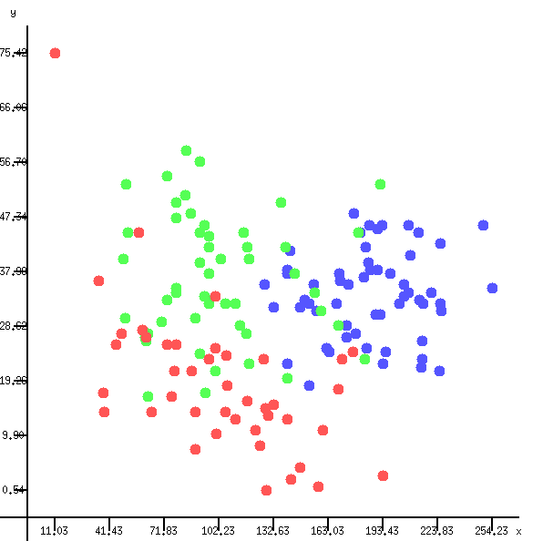
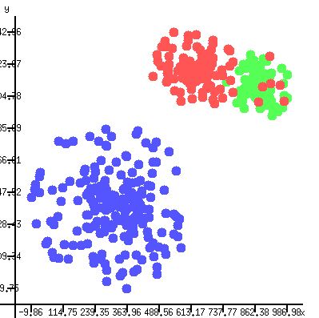
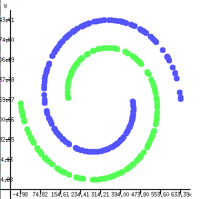
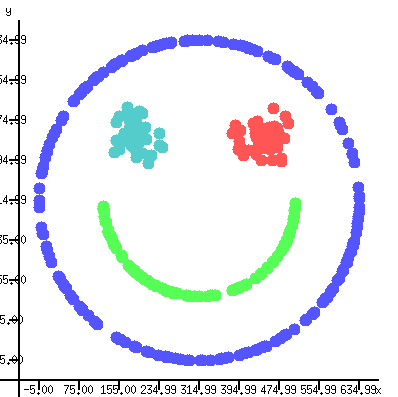

# Clustering Algorithms [](https://github.com/Physicc/Light/actions/workflows/linux-gcc.yml)

This is a project made for the CS293 course at IITB.

## Supported Platforms:
* Ubuntu 20

## Prerequisites
* GCC(>=8)
* Simplecpp : Download simplecpp library version for Linux from [Prof. Ranade's website](https://www.cse.iitb.ac.in/~ranade/simplecpp/). Follow the instructions in its README for installation

## Installation
* Recursively clone the git module:
```https://github.com/VedangAsgaonkar/Clustering-Algorithms```
* In the working directory, open the makefile
* Change the ```SIMPLECPP``` path in the makefile to the path to the simplecpp installation in your system

## Overview
I have implemented four major clustering algorithms:
* K-means clustering : [class kMeansEstimator](include/cluster/kMeansEstimator.hpp)
* Gaussian Bayesian Clustering : [class gaussianEstimator](include/cluster/gaussianEstimator.hpp)
* Density Based Clustering : [class densityBasedEstimator](include/cluster/densityBasedEstimator.hpp)
* Hierarchical Clustering : [class hierarchicalEstimator](include/cluster/hierarchicalEstimator.hpp)

I have also implemented a plotter : [class plotter](include/plotter/plotter.hpp) using simplecpp as a renderer for these algorithms. The plotter can render scatter plots for all of the data, showing different colors for different clusters. The algorithms will print the clusters to STDOUT and also plot them using the plotter.

## Structure
```
.
├── include
│   ├── cluster
│   │   ├── densityBasedEstimator.hpp
│   │   ├── gaussianEstimator.hpp
│   │   ├── hierarchicalEstimator.hpp
│   │   └── kMeansEstimator.hpp
│   ├── plotter
│   │   └── plotter.hpp
│   └── util
│       ├── edge.hpp
│       ├── matrix2.hpp
│       ├── point.hpp
│       ├── range_point.hpp
│       ├── union_point.hpp
│       └── vec2.hpp
├── src
    ├── cluster
    │   ├── densityBasedEstimator.cpp
    │   ├── gaussianEstimator.cpp
    │   ├── hierarchicalEstimator.cpp
    │   └── kMeansEstimator.cpp
    ├── plotter
    │   └── plotter.cpp
    └── util
        ├── edge.cpp
        ├── matrix2.cpp
        ├── point.cpp
        ├── range_point.cpp
        ├── union_point.cpp
        └── vec2.cpp

```
## Algorithms
### K-means Clustering
K-means clustering has the following pseudo-code:
```
cluster_centers = random[k]
for it in num_epochs:
    for point in points:
        cluster[point] = argmin(i, distance(point, cluster_centers[i]))
    for i in range(k):
        cluster_centers[i] = mean([point for point in points where cluster[point] == i])
```
As an example I have used k-means clustering on the [Wine Clustering Dataset from Kaggle](https://www.kaggle.com/harrywang/wine-dataset-for-clustering), which clusters different beverages based on their characteristics. To run this code use :
```
make wine
./wine
make clean
```
<br>

<br>

### Gaussian Clustering
Gaussian Clustering works according to the following pseudo-code:
```
cluster_means = random[k]
cluster_covariances = random2x2matrix[k]
for it in n_epochs:
    for point in points:
        cluster[point] = argmax(i, probability(point, cluster_centers[i], cluster_covariances[i]))
    for i in range(k):
        cluster_means[i] = mean([point for point in points where cluster[point] == i])  
        cluster_covariances[i] = covariance([point for point in points where cluster[point] == i])
```
I have created an example to show the utility of this algorithm. To run the code use:
```
make main
./main
make clean
```
<br>

<br>

### Hierarchical Clustering
Hierarchical Clustering works on the following algorithm:
```
priority_queue P(priority = distance)
for i in range(points.size()):
    for j in range(i+1, points.size()):
        if distance(points[i], points[j]) < epsilon:
            P.insert(edge(points[i], points[j]))
count = 0
while(count < points.size()-k):
    e = P.pop()
    if e.first.union_number != e.second.union_number:
        union(e.first, e.second)
        count += 1
for point in points:
    cluster[point] = point.union_number
```
As an example of this I have carried out the following clustering task:
```
make spiral
./spiral
make clean
```
<br>

<br>

### Density Based Clustering
Density based clustering works on the following algorithm
```
queue Q
cluster_count = 0
for point in points:
    if not point.is_clustered:
        Q.insert(point)
        cluster[point] = cluster_count
        while not Q.empty():
            p = Q.pop()
            if p.num_neighbours > min_neighbours:
                for u in p.neighbours:
                    if not u.is_clustered:
                        Q.push(u)
                        cluster[u] = cluster_count
        cluster_count += 1
```
As an example of density based clustering I have created the following:
```
make smile
./smile
make clean
```

<br>

<br>

## Plotter
The plotter class has been created using simplecpp to make scatter plots. It runs on a parallel thread as the function creating the plot and hence can plot changes in real time. It allows the calling program to label the points according to their clusters and plots them in different colours. It also has other standard features such as labelled axes. The class is thread safe due to the use of locks and mutexes while creating functions that display the points.

## Use of Datastructures and Algorithms
The following Datastructures were used:
* Hash map : ```std::unordered_map<int, int> colors```
* Red-black Tree : ```std::multimap<int, int> clusters```
* Priority Queue : ```std::priority_queue<edge, std::vector<edge>, std::function<bool(edge &, edge &)>> edge_list;```
* Union finding structure : ```class union_point```
* Graph : ```class range_point```

The following algorithms were used:
* K-means clustering
* Gaussian clustering
* Hierarchical clustering
* Density based clustering
* Breadth first search